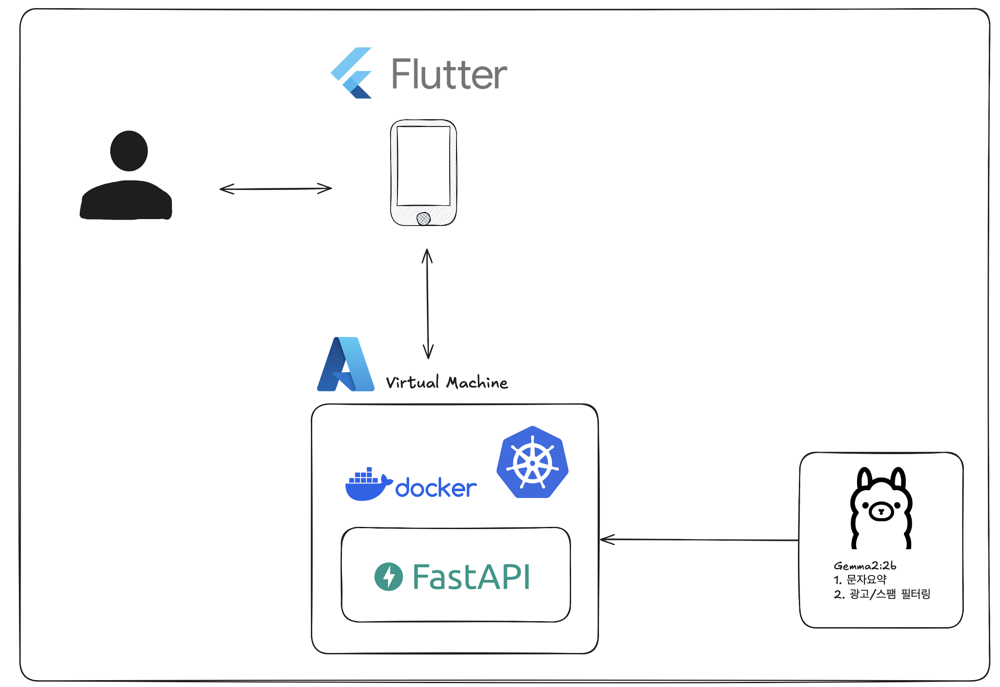

# gemma2-2b_messageSummary
할머니를 위한 맞춤형 문자요약 및 광고스팸필터링 AI모델

## 목표
- **사용자 친화적인 스마트폰 경험 제공**: 고령층 사용자들이 스마트폰을 보다 쉽고 직관적으로 사용할 수 있도록 사용자 인터페이스(UI)와 사용자 경험(UX)을 개선합니다.
- **맞춤형 서비스 제공**: 고령층 사용자의 필요에 맞춘 문자요약 및 광고/스팸 필터링 기능을 제공합니다.

## 화면구성

## 시스템 아키텍처

### 주의
보안 문제 상 백엔드와 프론트엔드 코드가 들어가 있는 레퍼지토리는 Private으로 처리했습니다. 양해 부탁드립니다.
